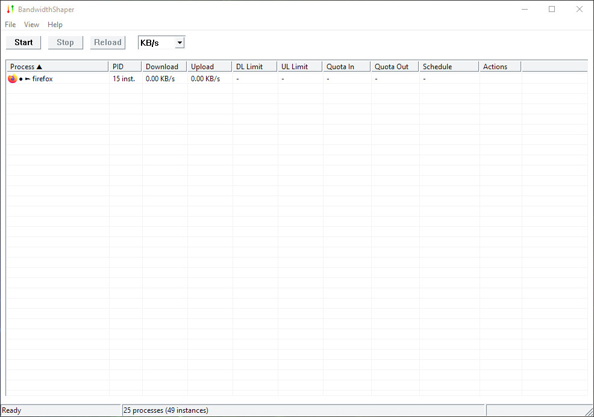

# BandwidthShaper

## Description
This is a small, portable tool to limit bandwidth in Windows. Available for both 32-bit and 64-bit systems.

### License and Compatibility Notice
This application uses [WinDivert](https://reqrypt.org/windivert.html) to accomplish network traffic shaping. WinDivert is licensed under the GNU Lesser General Public License v3 (LGPL v3). You can find the full license text [here](https://github.com/basil00/WinDivert/blob/master/LICENSE).

WinDivert itself should support the most recent Windows operating systems, starting from Windows Vista and Windows Server 2008. It does not support older Windows versions like Windows XP. For that, you can use [Traffic Shaper XP](https://www.majorgeeks.com/files/details/traffic_shaper_xp.html) instead.

## Two Editions

BandwidthShaper comes in two editions now: GUI and CLI. Previously, only the CLI application existed, but with the GUI, it's a lot more user-friendly. No installation required, just extract to a suitable location and run with administrator privileges.

### GUI version



The GUI app should be pretty self-explanatory and easy to use, but here's a little help to get started:

* Run `BandwidthShaper.exe` as Administrator
* Go to **View** -> **Options** and select your network interface(s)
* Set your desired download/upload limits
* Click **Start** to begin throttling
* Monitor traffic in the process list
* Double-click any cell to set limits, quotas, or schedules
* Right-click processes for advanced options

There's also a feature called "sticky processes". These remain in the list even when not running, which can be useful for persistent rules (e.g., always limit browser traffic).

### CLI version

The CLI version has the following optoins available:

```
Usage: BandwidthShaper [OPTIONS]
Options:
  -C, --config <path>                           Load configuration from INI-style file (overrides CLI arguments)
  -P, --priority <NUM>                          Set WinDivert priority (default: 0, range: -30000 to 30000)
  -p, --process <process1,process2,...>         List of process names to monitor (comma-separated)
  -z, --pid <pidnum1,pidnum2,...>               List of PIDs to monitor (comma-separated)
  -c, --rule <process|PID> <DL_RATE> <UL_RATE>  Set custom rate limit(s) for a process or PID
  -S, --stop-at <process|PID> <QI> <QO>         Set inbound/outbound data quota for a process or PID
                                                  Quota values accept units: b, KB, MB, GB (e.g. 500MB)
  -T, --schedule [HHMM-HHMM][~<days>]           Restrict preceding -p/-z/-c/-S to a time/day window
                                                  Days: 1=Mon..7=Sun; ranges (1-5) and lists (1,3,5) OK
                                                  Examples: 0800-1800~1-5  2200-0600~6,7
  -Q, --quota-check-interval <ms>               How often to check quotas/schedules (default: 15000ms)
  -i, --process-update-interval <NUM>[p|t][,c]  Packet/time threshold for PID refresh + optional cooldown
  -a, --disable-after <RATE>[KB|MB|GB]          Disable internet after reaching data cap (0 = no cap)
  -d, --download <RATE>[b|Kb|KB|Mb|MB|Gb|GB]    Download speed limit per second (default unit: KB)
  -u, --upload   <RATE>[b|Kb|KB|Mb|MB|Gb|GB]    Upload speed limit per second (default unit: KB)
  -D, --download-buffer <bytes>                 Max download buffer size in bytes (default: 150000)
  -U, --upload-buffer   <bytes>                 Max upload buffer size in bytes (default: 150000)
  -t, --tcp-limit <NUM>                         Max active TCP connections (0 = unlimited)
  -r, --udp-limit <NUM>                         Max UDP packets/sec (0 = unlimited)
  -b, --burst <RATE>[b|Kb|KB|Mb|MB|Gb|GB]       Burst size override (0 = use buffer size)
  -L, --latency <ms>                            Simulated latency in ms (0 = none)
  -m, --packet-loss <float>                     Simulated packet loss % (0.00 = none)
  -n, --nic <index>[:<DL>:<UL>][,...]           NIC index(es) to throttle; optional per-NIC rates
  -l, --list-nics                               List all available network interfaces
  -s, --statistics                              Enable periodic statistics output
  -q, --quiet                                   Suppress most console messages
  -v, --version                                 Display version and exit
  -h, --help                                    Display this help and exit
```

You can also use the supplied **BandwidthShaper.ini** configuration file so that you don't need to always use parameters.

Some examples below...

```
# Global limit on interface 15
BandwidthShaper.exe -n 15 -d 1MB -u 500KB

# Multiple interfaces with different rates
BandwidthShaper.exe -n 14:2MB:1MB,15:1MB:500KB

# Limit specific processes
BandwidthShaper.exe -n 15 -p chrome.exe,firefox.exe -d 500KB -u 100KB

# Different limits per process
BandwidthShaper.exe -n 15 -c "chrome.exe 1MB 200KB" -c "firefox.exe 500KB 100KB"

# Target specific PIDs
BandwidthShaper.exe -n 15 -z 1234,5678 -d 500KB -u 100KB

# Stop Chrome after 1GB download or 500MB upload
BandwidthShaper.exe -n 15 -S chrome.exe 1GB 500MB

# Quota with rate limits
BandwidthShaper.exe -n 15 -c "chrome.exe 1MB 200KB" -S chrome.exe 1GB 500MB

# Weekdays 8am-6pm only
BandwidthShaper.exe -n 15 -p chrome.exe -d 500KB -T 0800-1800~1-5

# Weekend overnight only
BandwidthShaper.exe -n 15 -c "steam.exe 2MB 1MB" -T 2200-0600~6,7

# NIC 14: 2MB down, 1MB up
# NIC 15: 1MB down, 500KB up
BandwidthShaper.exe -n 14:2MB:1MB,15:1MB:500KB

# Block uploads for chrome.exe
BandwidthShaper.exe -c "chrome.exe 1MB -1"

# Update every 1000 packets
BandwidthShaper.exe -p chrome.exe -i 1000p

# Update every 5 seconds
BandwidthShaper.exe -p chrome.exe -i 5000t
```

Schedules can be applied to specific processes in two ways. One is to use command-line arguments, where the schedule applies to the immediately preceding process target:

```
# Apply schedule to a specific process rule
bandwidthshaper.exe -c "chrome.exe 5MB 2MB" -T "0800-1800~1-5"

# Apply schedule to a stop-at quota rule
bandwidthshaper.exe -S "firefox.exe 1GB 500MB" -T "2200-0600~6,7"

# Apply schedule to a process list
bandwidthshaper.exe -p "chrome.exe,firefox.exe" -T "0900-1700~1-5"

# Apply schedule to specific PIDs
bandwidthshaper.exe -z 1234,5678 -T "1800-2200~1-5"
```

The second method is using the configuration file, in this case, schedules are applied to the most recently defined rule:

```
# Rule for Chrome with schedule
rule = chrome.exe 5MB 2MB
schedule = 0800-1800~1-5    ; Only applies to Chrome, weekdays 8am-6pm

# Rule for Firefox with different schedule  
rule = firefox.exe 3MB 1MB
schedule = 2200-0600~6,7    ; Only applies to Firefox, weekends overnight

# Stop-at quota with schedule
stop-at = edge.exe 500MB 250MB
schedule = 0900-1700~1-5     ; Only applies to Edge, business hours

# Process list with schedule
process = notepad.exe,calc.exe
schedule = 1800-2200~1-5     ; Only applies to Notepad and Calculator, evenings

# This schedule would apply to any previously defined rule that doesn't have its own
schedule = 0000-2359~1-7      ; Global fallback schedule
```

There has to be a --rule, --stop-at, --process, or --pid before the --schedule. If yes, it applies the schedule to that specific rule. If not, it becomes a global schedule that applies to all throttled traffic. So you have to remember, that the order matters here: the schedule must come after the process/rule it applies to, not before. Each process target can have its own unique schedule. If a schedule appears before any process targets, it applies to all throttled traffic.

## Issues

- **"Saved NIC not found" warning:** The network adapter got changed or disabled. Go to Options and reselect your NICs.

- **No throttling happening:** Check if you use the correct NIC index (use --list-nics) in the CLI and the correct NIC in the GUI app. Make sure you have admin privileges. There should be no conflicting QoS or router throttling - if there are, either use those or this app, but not both. Also check that the WinDivert service isn't stuck.

- **My internet connection stopped working:** The throttler may get blocked by a third party firewall or other security software automatically (if it's configured to only allow whitelisted processes or apps), which means your internet will no longer work. You have to whitelist this throttler or set your firewall/security software to learning mode, and allow it that way when it notifies you. If you want to test if this is the cause, try to temporarily disable your firewall or security software and see if that makes it work.

- **Throttling doesn't seem to work:** Certain apps may not play well with the throttling itself. They may reject the connection quickly or immediately. Sometimes this means you can't throttle those apps, if they have detection algorithm(s) for this intentionally.

- **Invalid digital signature error message for the "WinDivert64.sys" or "WinDivert32.sys" file:** This may happen when running on an unsupported Windows operating system, such as Windows 7. In this case the driver can only be loaded if you disable "driver signature enforcement" in Windows. To do this, with Windows 7, you can restart the computer and keep pressing F8 until the advanced boot options menu gets displayed. Then choose "Disable driver signature enforcement". Obviously this is not recommended or a safe practice, but it's the only way to get it working on an unsupported OS. Due to security, Windows will not load the needed driver and thus no traffic shaping can take place. For a more permanent solution, you can test [sign the driver](https://reqrypt.org/windivert-faq.html#q3) yourself. [Click here](https://www.richud.com/wiki/Windows_7_Install_Unsigned_Drivers_CAT_fix) for another example.

- **I want to limit the download speed to only affect file downloads:** Your global download limit will be the overall max bandwidth available and that will be shared between all the file downloads and your network applications like a browser. This is when you should also set the TCP limit option with a reasonable number (not too low, not too high). That will slow down your current download speed for the bigger files, while you also reserve bandwidth for your other applications.

## WinDivert Cleanup

If the shaper exits uncleanly, the driver may remain loaded, so either reboot to unload the driver or clean it up manually with these commands in a CMD or PowerShell window:

```
sc stop WinDivert
sc delete WinDivert
sc query WinDivert  # Check status
```

---

## Background Info
Why was this made? The reason being is that most apps that serve this purpose can be rather complex (with many extra features) and they are usually commercial in Windows, such as [NetLimiter](https://www.netlimiter.com), [NetBalancer](https://netbalancer.com) or [SoftPerfect Bandwidth Manager](https://www.softperfect.com/products/bandwidth). At best, you can use [TMeter](http://www.tmeter.ru/en) as a free option. None of these were really appealing to me for simple bandwidth throttling (and I had no other extra need!). Now, if you ever had to use an ADSL/VDSL connection, you will know how much the upload saturation sucks, even with a smaller file. Downloading a larger file can also lead to network saturation. When this happens, browsing a website simply becomes a nightmare, as if you had a very poor connection. However, a little limit on both the download and upload speed will fix this issue. So I needed the most lightweight and portable option to throttle my download and upload speed, I did not need much else. I couldn't be bothered with router or firewall shenanigans, and a quick "on or off" via a simple tool was what I required.

Therefore, this app is only useful if you want to limit the bandwidth, either globally or for certain processes - and you really don't want much more than that. If you want other network-related features, like filtering, traffic monitoring, packet logging, quotas, predefined rules or policies, priorities per process/app, predefined break periods with alternate rate limits or no throttling, etc., then this is not the networking tool for that. For those extra features, some of the earlier mentioned apps are going to do a much better job (the downside is that they are commercial, but hey, something for something!). Of course, if that does not suit you, you're always free to fork the source code and expand on this as you'd like, you may even add a GUI! Feel free to do with it as you want (although mentioning me in the credits would be a nice gesture).

**Note:** It should go without saying, but this tool is not meant to limit the bandwidth of other computers in a network. Most likely your computer does not act as a router (gateway machine), so you will not be able to see the traffic of other users in a typical home, office or work environment. Assuming you're in a sys admin role, you're much better off using a router or firewall with pfSense or similar that has traffic shaping support or QoS, or running a transparent proxy like Squid. This small tool is for very simple use cases only. Always choose the right tool for the required job.
